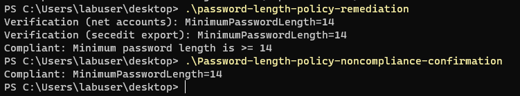
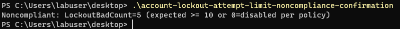
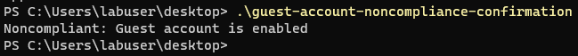
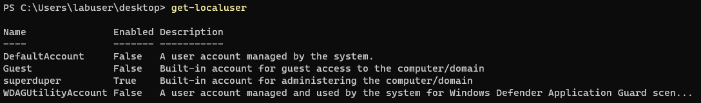
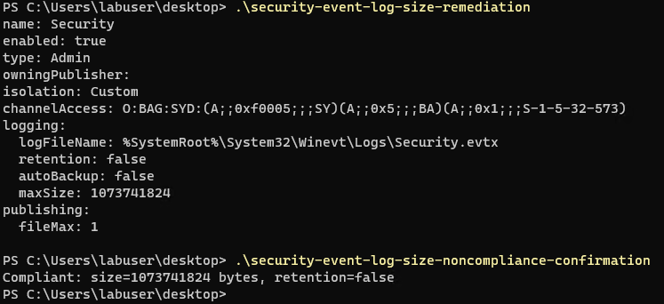
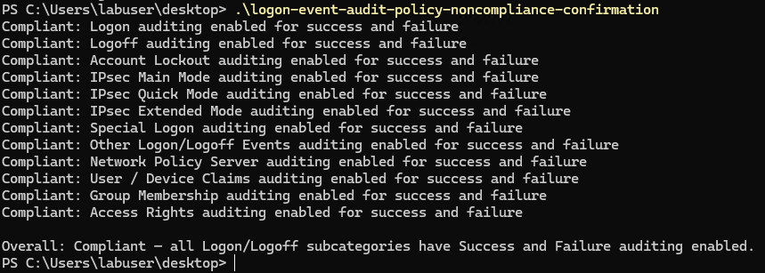
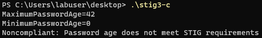
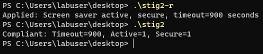

# Windows 11 STIG remediation scripts  
  
## Table of Contents  
- [Password length policy (minimum 14) - WN11-AC-000035](#password-length-policy-minimum-14---wn11-ac-000035)
- [Account lockout threshold (e.g., 10 invalid attempts) - WN11-AC-000010](#account-lockout-threshold-eg-10-invalid-attempts---wn11-ac-000010)
- [Guest account disabled - WN11-SO-000010](#guest-account-disabled---wn11-so-000010)
- [Administrator account renamed (require NLA-safe custom name) - WN11-SO-000020](#administrator-account-renamed-require-nla-safe-custom-name---wn11-so-000020)
- [Security event log size and overwrite policy - WN11-AU-000505](#security-event-log-size-and-overwrite-policy---wn11-au-000505)
- [Audit policy logon events (success and failure) - WN11-AU-000560 (Successes) / WN11-AU-000565 (Failures)](#audit-policy-logon-events-success-and-failure---wn11-au-000560-successes--wn11-au-000565-failures)
- [Minimum password age greater than or equal to 1 day - WN11-AC-000055](#minimum-password-age-greater-than-or-equal-to-1-day---wn11-ac-000055)
- [SMBv1 disabled - WN11-00-000160](#smbv1-disabled---wn11-00-000160)
- [Autoplay must be disabled - WN11-CC-000190 (all drives) / WN11-CC-000180 (non-volume devices)](#autoplay-must-be-disabled---wn11-cc-000190-all-drives--wn11-cc-000180-non-volume-devices)
- [Screen saver timeout with secure lock (15 minutes) - WN11-SO-000070](#screen-saver-timeout-with-secure-lock-15-minutes---wn11-so-000070)
  
## **Password length policy (minimum 14) - WN11-AC-000035**
**Confirm noncompliance**
```
# Confirm Minimum Password Length compliance
# Exports local security policy and checks the MinimumPasswordLength setting

$TempInf = Join-Path $env:TEMP "secpol-export.inf"
secedit /export /cfg $TempInf | Out-Null

# Look for the line containing MinimumPasswordLength
$line = Get-Content $TempInf | Where-Object { $_ -match '^MinimumPasswordLength' }

if ($line) {
    # Split on '=' and trim the value
    $minLen = [int]($line -split '=')[1].Trim()
} else {
    $minLen = $null
}

Remove-Item $TempInf -Force -ErrorAction Ignore

if ($null -eq $minLen) {
    Write-Host "Noncompliant: MinimumPasswordLength not found"
    exit 1
}
elseif ($minLen -lt 14) {
    Write-Host "Noncompliant: MinimumPasswordLength is $minLen (expected >= 14)"
    exit 1
}
else {
    Write-Host "Compliant: MinimumPasswordLength=$minLen"
}
```
Screenshot: 

**Remediate:**
```
# Requires: Run as Administrator

function Set-MinPasswordLength {
    param(
        [Parameter()][ValidateRange(1,128)][int]$Length = 14
    )

    # 1) Apply via properly formed INF (secedit needs headers)
    $infContent = @"
[Unicode]
Unicode=yes

[Version]
signature="$CHICAGO$"
Revision=1

[System Access]
MinimumPasswordLength = $Length
"@

    $cfgPath = Join-Path $env:TEMP "secpol-apply.inf"
    $verifyPath = Join-Path $env:TEMP "secpol-verify.inf"

    $infContent | Set-Content -Path $cfgPath -Encoding ASCII -Force

    # Apply to the local security database
    secedit /configure /db secedit.sdb /cfg $cfgPath /quiet | Out-Null

    # Refresh local policy
    secedit /refreshpolicy machine_policy /enforce | Out-Null

    # 2) Also set via SAM to ensure local account policy updates
    cmd /c "net accounts /minpwlen:$Length" | Out-Null

    Start-Sleep -Seconds 2

    # 3) Verify via both paths

    # 3a) Verify via `net accounts`
    $netOut = cmd /c "net accounts"
    $netMin = $null
    foreach ($l in $netOut) {
        if ($l -match 'Minimum password length') {
            $netMin = [int](([regex]::Match($l, '(\d+)')).Groups[1].Value)
            break
        }
    }

    # 3b) Verify via secedit export
    secedit /export /cfg $verifyPath | Out-Null
    $line = Get-Content $verifyPath | Where-Object { $_ -match '^MinimumPasswordLength' }
    $seceditMin = if ($line) { [int]($line -split '=')[1].Trim() } else { $null }

    # Cleanup temp files
    Remove-Item $cfgPath, $verifyPath -Force -ErrorAction Ignore

    # 4) Report results clearly
    Write-Host "Verification (net accounts): MinimumPasswordLength=$netMin"
    Write-Host "Verification (secedit export): MinimumPasswordLength=$seceditMin"

    if ($netMin -ge $Length -and $seceditMin -ge $Length) {
        Write-Host "Compliant: Minimum password length is >= $Length"
        return
    }

    # Detect likely override conditions
    if ($netMin -lt $Length -or $seceditMin -lt $Length) {
        Write-Warning "Noncompliant: Minimum password length is below $Length."
        Write-Host "Possible causes:"
        Write-Host " - Domain GPO or Fine-Grained Password Policy overriding local settings"
        Write-Host " - Policy not applied due to service/state; try reboot or gpupdate /force"
        Write-Host " - Running in non-elevated context"

        Write-Host "Next steps:"
        Write-Host " - Run: gpupdate /force"
        Write-Host " - Reboot and re-run verification"
        Write-Host " - If joined to a domain: check RSOP.msc or gpresult /H report.html for overriding password policy"
    }
}

# Execute remediation and verification
Set-MinPasswordLength -Length 14
```
Screenshot:

## **Account lockout threshold (e.g., 10 invalid attempts) - WN11-AC-000010**
**Confirm noncompliance**
```
# Checks LockoutBadCount via secedit export
$TempInf = Join-Path $env:TEMP "secpol-export.inf"
secedit /export /cfg $TempInf | Out-Null
$threshold = (Select-String -Path $TempInf -Pattern '^LockoutBadCount\s*=\s*(\d+)' | ForEach-Object { [int]$Matches[1] })
Remove-Item $TempInf -Force -ErrorAction Ignore

if ($null -eq $threshold) {
    Write-Host "Noncompliant: LockoutBadCount not found"
    exit 1
}
if ($threshold -lt 10 -and $threshold -ne 0) {
    Write-Host "Noncompliant: LockoutBadCount=$threshold (expected >= 10 or 0=disabled per policy)"
    exit 1
}
Write-Host "Compliant: LockoutBadCount=$threshold"
```
Screenshot: 

**Remediate:**
```
# Remediate LockoutBadCount to 10 and verify
param(
    [Parameter()][ValidateRange(1,999)][int]$DesiredThreshold = 10
)

# Proper INF for secedit
$infContent = @"
[Unicode]
Unicode=yes

[Version]
signature="$CHICAGO$"
Revision=1

[System Access]
LockoutBadCount = $DesiredThreshold
"@

$cfgPath    = Join-Path $env:TEMP "secpol-apply.inf"
$verifyPath = Join-Path $env:TEMP "secpol-verify.inf"

$infContent | Set-Content -Path $cfgPath -Encoding ASCII -Force

# Apply via local security database
secedit /configure /db secedit.sdb /cfg $cfgPath /quiet | Out-Null

# Also set via SAM for reliability
cmd /c "net accounts /lockoutthreshold:$DesiredThreshold" | Out-Null

# Optional: refresh policy
secedit /refreshpolicy machine_policy /enforce | Out-Null
Start-Sleep -Seconds 2

# Verify via net accounts
$netOut = cmd /c "net accounts"
$netThreshold = $null
foreach ($l in $netOut) {
    if ($l -match 'Lockout threshold') {
        $netThreshold = [int](([regex]::Match($l, '(\d+)')).Groups[1].Value)
        break
    }
}

# Verify via secedit export
secedit /export /cfg $verifyPath | Out-Null
$line = Get-Content $verifyPath | Where-Object { $_ -match '^LockoutBadCount\s*=' }
$seceditThreshold = if ($line) { [int]($line -split '=')[1].Trim() } else { $null }

# Cleanup
Remove-Item $cfgPath,$verifyPath -Force -ErrorAction Ignore

Write-Host "Verification (net accounts): LockoutThreshold=$netThreshold"
Write-Host "Verification (secedit export): LockoutBadCount=$seceditThreshold"

if ($netThreshold -ge $DesiredThreshold -and $seceditThreshold -ge $DesiredThreshold) {
    Write-Host "Compliant: LockoutBadCount >= $DesiredThreshold"
} else {
    Write-Warning "Noncompliant: Threshold below $DesiredThreshold."
    Write-Host "Possible causes:"
    Write-Host " - Domain GPO overriding local settings"
    Write-Host " - Policy not fully applied; try gpupdate /force or reboot"
    Write-Host " - Run script elevated"
}
```
Screenshot: 


## **Guest account disabled - WN11-SO-000010**
**Confirm noncompliance**
```
try {
    $guest = Get-LocalUser -Name "Guest" -ErrorAction Stop
    if ($guest.Enabled) {
        Write-Host "Noncompliant: Guest account is enabled"
        exit 1
    } else {
        Write-Host "Compliant: Guest account is disabled"
    }
} catch {
    Write-Host "Compliant: Guest account not present"
}
```
Screenshot: 

**Remediate:**
```
# Disables Guest account (creates if absent then disables for demo consistency)
$guest = Get-LocalUser -Name "Guest" -ErrorAction SilentlyContinue
if (-not $guest) {
    New-LocalUser -Name "Guest" -NoPassword -ErrorAction SilentlyContinue | Out-Null
}
Disable-LocalUser -Name "Guest" -ErrorAction Stop
Write-Host "Applied: Guest account disabled"
```
Screenshot: 


## **Administrator account renamed (require NLA‑safe custom name) - WN11-SO-000020**
**Confirm noncompliance**
```
# Checks if a local account with SID ending -500 (built-in Administrator) still uses name 'Administrator'
$adminSID = (Get-CimInstance Win32_UserAccount -Filter "Domain='$env:COMPUTERNAME' AND LocalAccount=True").Where({ $_.SID -match '-500$' })
if ($adminSID -eq $null) { Write-Host "Compliant: Built-in Administrator not found"; exit 0 }
if ($adminSID.Name -eq 'Administrator') {
    Write-Host "Noncompliant: Built-in Administrator uses default name 'Administrator'"
    exit 1
}
Write-Host "Compliant: Built-in Administrator renamed to '$($adminSID.Name)'"
```
Screenshot:   

**Remediate:**
```
# Rename built-in Administrator to "labuser"

$TargetName = "labuser"

function Test-IsElevated {
    $id = [Security.Principal.WindowsIdentity]::GetCurrent()
    $p  = New-Object Security.Principal.WindowsPrincipal($id)
    $p.IsInRole([Security.Principal.WindowsBuiltInRole]::Administrator)
}

if (-not (Test-IsElevated)) {
    Write-Warning "Not elevated. Right-click PowerShell and select 'Run as administrator'."
    return
}

if (-not [Environment]::Is64BitProcess) {
    Write-Warning "Running 32-bit PowerShell. Use 64-bit PowerShell on 64-bit Windows."
    return
}

# Find the built-in Administrator (SID ends with -500)
$adminUser = Get-LocalUser | Where-Object { $_.SID -match '-500$' }

if ($null -eq $adminUser) {
    Write-Warning "Built-in Administrator (SID -500) not found on this system."
    return
}

$currentName = $adminUser.Name
Write-Host "Found built-in Administrator: Name='$currentName', SID='$($adminUser.SID)'"

# If target name already exists as a separate user, we cannot rename to it
$existingTarget = Get-LocalUser -Name $TargetName -ErrorAction SilentlyContinue
if ($existingTarget -and $existingTarget.SID -ne $adminUser.SID) {
    Write-Warning "A different local user named '$TargetName' already exists (SID $($existingTarget.SID)). Rename or remove that user first."
    return
}

# If it's already the target name, we're done
if ($currentName -eq $TargetName) {
    Write-Host "Already named '$TargetName'. Nothing to change."
    return
}

# Attempt rename
try {
    Rename-LocalUser -Name $currentName -NewName $TargetName -ErrorAction Stop
    Write-Host "Renamed built-in Administrator from '$currentName' to '$TargetName'."
} catch {
    Write-Warning "Rename failed: $($_.Exception.Message)"
    Write-Host "Troubleshooting:"
    Write-Host " - Ensure no conflicting local user 'labuser' exists."
    Write-Host " - Verify elevation and 64-bit PowerShell."
    Write-Host " - Close sessions using the Administrator account (log off RDP/Console)."
    Write-Host " - Check local security policy/GPO setting 'Accounts: Rename administrator account'."
    return
}

# Verify by SID again
$verify = Get-LocalUser | Where-Object { $_.SID -match '-500$' }
Write-Host "Verification: Name='$($verify.Name)', SID='$($verify.SID)'"
```
Screenshot:   


## **Security event log size and overwrite policy - WN11-AU-000505**
**Confirm noncompliance**
```
# Expect max size >= 1GB and overwrite as needed (retention=false)
$info = wevtutil gl Security
$size = [int]((($info | Select-String 'maxSize:').ToString().Split(':')[1]).Trim())
$retention = (($info | Select-String 'retention:').ToString().Split(':')[1]).Trim()

# wevtutil returns size in bytes
if ($size -lt 1073741824 -or $retention -ne 'false') {
    Write-Host "Noncompliant: size=$size bytes (>=1GB required), retention=$retention (false required)"
    exit 1
}
Write-Host "Compliant: size=$size bytes, retention=$retention"
```
Screenshot:    

**Remediate:**
```
# Set Security log max size to 1GB and overwrite as needed
wevtutil sl Security /ms:1073741824 /rt:false
$info = wevtutil gl Security
Write-Host ($info | Out-String)
```
Screenshot:   


## **Audit policy: logon events (success and failure) - WN11-AU-000560 (Successes) / WN11-AU-000565 (Failures)**
**Confirm noncompliance**
```
# Compliance check for all Logon/Logoff audit subcategories
# Run as Administrator

$subcategories = auditpol /get /category:"Logon/Logoff" |
    ForEach-Object {
        if ($_ -match '^\s{2,}(.+?)\s{2,}(Success|Failure|No Auditing|Success and Failure)') {
            $matches[1].Trim()
        }
    } | Where-Object { $_ -ne $null }

$noncompliant = @()

foreach ($sub in $subcategories) {
    $output = auditpol /get /subcategory:"$sub" | Out-String

    # Match either explicit Success/Failure lines OR combined "Success and Failure"
    $success = ($output -match 'Success\s*:\s*Enabled') -or ($output -match 'Success and Failure')
    $failure = ($output -match 'Failure\s*:\s*Enabled') -or ($output -match 'Success and Failure')

    if (-not $success -or -not $failure) {
        $noncompliant += $sub
        Write-Host "Noncompliant: $sub auditing success=$success, failure=$failure"
    } else {
        Write-Host "Compliant: $sub auditing enabled for success and failure"
    }
}

if ($noncompliant.Count -eq 0) {
    Write-Host "`nOverall: Compliant — all Logon/Logoff subcategories have Success and Failure auditing enabled."
} else {
    Write-Host "`nOverall: Noncompliant — the following subcategories are missing Success/Failure auditing:"
    $noncompliant | ForEach-Object { Write-Host " - $_" }
}
```
Screenshot:   

**Remediate:**
Initially I tried to bring the machine into compliance by running local `auditpol` scripts, but those changes didn’t stick because advanced audit policy overrides them. I ended up manually enabling Success and Failure auditing for all Logon/Logoff subcategories through local security policy.  
  
Screenshot:   


## **Minimum password age ≥ 1 day - STIG ID: WN11-AC-000055**
**Confirm noncompliance**
```
# Check password age compliance
# Run elevated

$TempInf = Join-Path $env:TEMP "secpol-export.inf"
secedit /export /cfg $TempInf | Out-Null

$maxLine = Get-Content $TempInf | Where-Object { $_ -match '^MaximumPasswordAge' }
$minLine = Get-Content $TempInf | Where-Object { $_ -match '^MinimumPasswordAge' }
Remove-Item $TempInf -Force -ErrorAction Ignore

$maxAge = if ($maxLine) { [int]($maxLine -split '=')[1].Trim() } else { $null }
$minAge = if ($minLine) { [int]($minLine -split '=')[1].Trim() } else { $null }

Write-Host "MaximumPasswordAge=$maxAge"
Write-Host "MinimumPasswordAge=$minAge"

if ($maxAge -le 60 -and $minAge -ge 1) {
    Write-Host "Compliant: Password age meets STIG requirements"
} else {
    Write-Host "Noncompliant: Password age does not meet STIG requirements"
    exit 1
}
```
Screenshot:   


**Remediate:**
```
cmd /c "net accounts /minpwage:1"
cmd /c "net accounts /maxpwage:60"
```
Screenshot:   


## **SMBv1 disabled - WN11-00-000160**
**Confirm noncompliance**
```
Enable-WindowsOptionalFeature -Online -FeatureName SMB1Protocol
```
Screenshot:   

**Remediate:**
```
Disable-WindowsOptionalFeature -Online -FeatureName SMB1Protocol -NoRestart -ErrorAction SilentlyContinue
$feature = Get-WindowsOptionalFeature -Online -FeatureName SMB1Protocol
Write-Host "Applied: SMB1Protocol state is $($feature.State)"
```
Screenshot:   


## **Autoplay Must Be Disabled - WN11-CC-000190 (all drives) / WN11-CC-000180 (non-volume devices)**
**Confirm noncompliance**
```
# Path to Autoplay policy registry key
$regPath = "HKLM:\Software\Microsoft\Windows\CurrentVersion\Policies\Explorer"
$valueName = "NoDriveTypeAutoRun"

# Try to read the value
try {
    $value = Get-ItemProperty -Path $regPath -Name $valueName -ErrorAction Stop | Select-Object -ExpandProperty $valueName

    Write-Host "Autoplay registry value: $value"

    switch ($value) {
        255 { Write-Host "Autoplay is DISABLED for all drives (compliant)." }
        default { Write-Host "Autoplay is ENABLED or partially enabled (non-compliant)." }
    }
}
catch {
    Write-Host "Autoplay registry key not found. Default behavior may allow Autoplay."
}
```
Screenshot:   

**Remediate:**
```
# Disable Autoplay/Autorun for all drives
$regPath = "HKLM:\Software\Microsoft\Windows\CurrentVersion\Policies\Explorer"
$valueName = "NoDriveTypeAutoRun"

# Apply remediation
New-Item -Path $regPath -Force | Out-Null
Set-ItemProperty -Path $regPath -Name $valueName -Type DWord -Value 255

# Verify compliance
$value = Get-ItemProperty -Path $regPath -Name $valueName | Select-Object -ExpandProperty $valueName
Write-Host "Autoplay registry value: $value"

if ($value -eq 255) {
    Write-Host "Autoplay STIG compliance: PASSED (disabled for all drives)"
} else {
    Write-Host "Autoplay STIG compliance: FAILED (value not set to 255)"
}
```
Screenshot:   


## **Screen saver timeout with secure lock (15 minutes) - WN11-SO-000070**
**Confirm noncompliance**
```
# STIG usually enforces via Policies path under HKCU
$base = 'HKCU:\Software\Policies\Microsoft\Windows\Control Panel\Desktop'
$timeout = (Get-ItemProperty -Path $base -Name 'ScreenSaveTimeOut' -ErrorAction SilentlyContinue).ScreenSaveTimeOut
$active  = (Get-ItemProperty -Path $base -Name 'ScreenSaveActive' -ErrorAction SilentlyContinue).ScreenSaveActive
$secure  = (Get-ItemProperty -Path $base -Name 'ScreenSaverIsSecure' -ErrorAction SilentlyContinue).ScreenSaverIsSecure

if ($timeout -lt 900 -or $active -ne '1' -or $secure -ne '1') {
    Write-Host "Noncompliant: Timeout=$timeout (>=900), Active=$active (1), Secure=$secure (1)"
    exit 1
}
Write-Host "Compliant: Timeout=$timeout, Active=$active, Secure=$secure"
```
Screenshot:   


**Remediate:**
```
$base = 'HKCU:\Software\Policies\Microsoft\Windows\Control Panel\Desktop'
New-Item -Path $base -Force | Out-Null
Set-ItemProperty -Path $base -Name 'ScreenSaveActive' -Value '1'
Set-ItemProperty -Path $base -Name 'ScreenSaverIsSecure' -Value '1'
Set-ItemProperty -Path $base -Name 'ScreenSaveTimeOut' -Value '900'
Write-Host "Applied: Screen saver active, secure, timeout=900 seconds"
```
Screenshot:   

